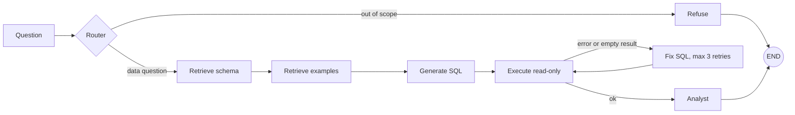

# InsightAgent: AI Data Analyst (Text-to-SQL with LangGraph)

Ask a business question in plain English. InsightAgent retrieves the relevant
tables, writes PostgreSQL, runs it read-only, repairs its own mistakes, and
explains the result.

Dataset: [Olist Brazilian E-Commerce](https://www.kaggle.com/datasets/olistbr/brazilian-ecommerce) (public, anonymized).

**Status:** local build, phases 0 to 5 done (data, eval set, baseline, schema RAG,
LangGraph flow). Next: SQL validator, MCP server, memory, API and UI.

## Results (50-question benchmark)

Accuracy = the generated query returns the same values as the hand-written gold SQL
(column aliases and row order are ignored).

| Version | What changed | Accuracy (held-out 50*) |
|---|---|---|
| baseline | full schema in the prompt | 57% |
| v2 | + schema retrieval + few-shot examples | 70% |
| v3 | + LangGraph router, retry loop, analyst | 82% |

\* These runs happened before the leakage fix: 20 benchmark questions were also in
the few-shot store, so only the other 30 are trustworthy. Re-run
`python -m eval.run_eval --version <v>` to refresh all three on the fixed benchmark
(each question now excludes its own example from retrieval). Raw legacy files are in
`eval/results/legacy/`. Failure analysis: [docs/failure_analysis.md](docs/failure_analysis.md).

## Architecture

- **Retrieval:** ChromaDB, one chunk per table plus question/SQL examples, embeddings from `gemini-embedding-001`.
- **LLM:** Groq (`openai/gpt-oss-120b`) through LangChain.
- **Safety:** every query runs in a read-only transaction with a 30 s timeout. A SQL validator and a read-only DB user come in phase 6.

