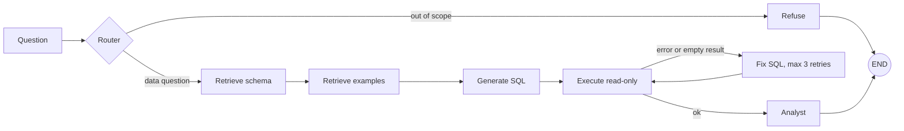

# InsightAgent: AI Data Analyst (Text-to-SQL with LangGraph)

Ask a business question in plain English. InsightAgent retrieves the relevant
tables, writes PostgreSQL, runs it read-only, repairs its own mistakes, and
explains the result.

Dataset: [Olist Brazilian E-Commerce](https://www.kaggle.com/datasets/olistbr/brazilian-ecommerce) (public, anonymized).

**Status:** local build, phases 0 to 5 done (data, eval set, baseline, schema RAG,
LangGraph flow). Next: SQL validator, MCP server, memory, API and UI.

## Results (50-question benchmark)

Accuracy = the generated query returns the same values as the hand-written gold SQL
(column aliases and row order are ignored).

| Version | What changed | Accuracy (held-out 30*) |
|---|---|---|
| baseline | full schema in the prompt | 57% |
| v2 | + schema retrieval + few-shot examples | 67% |
| v3 | + LangGraph router, retry loop, analyst | 73% |

\* These runs happened before the leakage fix: 20 benchmark questions were also in
the few-shot store, so only the other 30 are trustworthy. Re-run
`python -m eval.run_eval --version <v>` to refresh all three on the fixed benchmark
(each question now excludes its own example from retrieval). Raw legacy files are in
`eval/results/legacy/`. Failure analysis: [docs/failure_analysis.md](docs/failure_analysis.md).

## Architecture



- **Retrieval:** ChromaDB, one chunk per table plus question/SQL examples, embeddings from `all-MiniLM-L6-v2`.
- **LLM:** Groq (`openai/gpt-oss-120b`) through LangChain.
- **Safety (so far):** every query runs in a read-only transaction with a 30 s timeout. A SQL validator and a read-only DB user come in phase 6.


## Project structure

```
src/
  config.py  db.py  llm.py  embeddings.py  utils.py
  retrieval/     schema.py, examples.py, store.py
  graph/         state.py, builder.py, nodes/ (router, retrieve, generate_sql, execute_sql, fix_sql, analyst, refuse)
  pipelines/     baseline_v1.py, baseline_v2.py   (non-graph versions for the results table)
scripts/         import_data.py, build_index.py, validate_questions.py, check_connection.py
eval/            questions.json, compare.py, run_eval.py, show_failures.py, results/
tests/           pytest (no LLM, DB or API key needed)
data/            schema_docs.md, few_shot_examples.json   (CSVs and chroma/ are git-ignored)
db/schema.sql
```

## Run locally

```bash
python -m venv .venv && source .venv/bin/activate      # Windows: .venv\Scripts\activate
pip install -r requirements.txt
cp .env.example .env                                    # then fill in your keys

psql -U <user> -d insightdb -f db/schema.sql            # create tables
# put the 9 Olist CSV files in data/
python -m scripts.import_data                           # --reset to reload
python -m scripts.validate_questions                    # all gold SQL should run
python -m scripts.build_index                           # build the ChromaDB index

python -m src.graph.builder                             # ask one question
python -m eval.run_eval --version v3                    # full benchmark
python -m pytest                                        # unit tests
```
